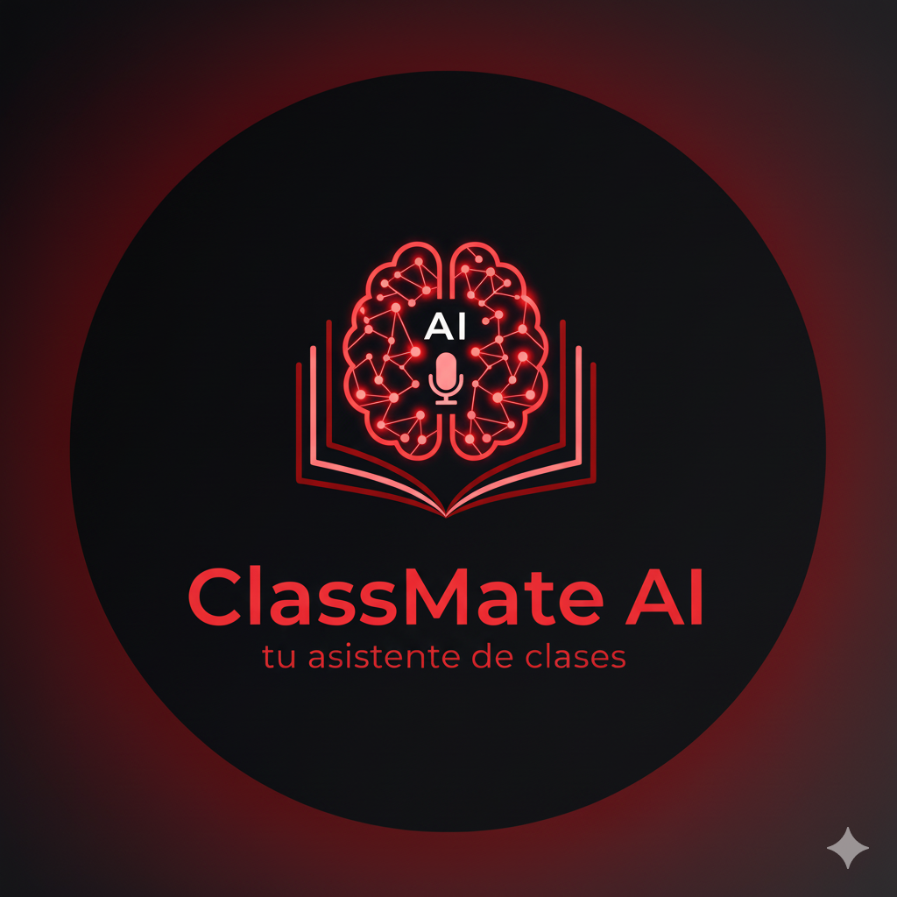

# ClassMate AI: Tu Asistente de Clases 🎓

  

---

## 🚀 Impulsa tus clases con ClassMate AI

¿Te imaginas transformar las largas grabaciones de tus clases en apuntes inteligentes y organizados con un solo clic? ¡Bienvenido a **ClassMate AI**!

Nuestro proyecto es un asistente académico diseñado para revolucionar tu forma de estudiar. Olvídate de pasar horas transcribiendo y organizando; nuestra aplicación lo hace por ti. Simplemente sube el audio de tu clase y deja que nuestra inteligencia artificial genere:

-   **Transcripciones precisas** del audio.
-   **Resúmenes automáticos** con los puntos clave.
-   **Preguntas y respuestas** para facilitar el repaso.
-   **Listas de tareas y pendientes** extraídas directamente de la clase.

Pero eso no es todo. **ClassMate AI** va un paso más allá, permitiéndote:

-   **Sincronizar tareas** directamente con tu **Google Calendar**.
-   **Interactuar con un chat de IA** para resolver dudas específicas sobre el contenido.
-   **Personalizar y editar** los apuntes generados.
-   **Exportar** tus notas en formatos como PDF, Word y TXT.

Con una interfaz intuitiva, adaptable a cualquier dispositivo y disponible en varios idiomas, **ClassMate AI** es la herramienta definitiva para optimizar tu tiempo, mejorar tu rendimiento académico y mantener tu vida universitaria perfectamente organizada.

**¡Únete a nosotros y lleva tu aprendizaje al siguiente nivel!**

---

## 👥 Integrantes del Grupo

Este proyecto es desarrollado por el grupo **# -No-Comments-** para la asignatura de Ingeniería de Software I de la Universidad Nacional de Colombia.

| Nombre Completo | Contacto (Email) |
| :-------------------------- | :------------------------------ |
| Nicolás Rodríguez Tapia | `nrodriguezt@unal.edu.co` |
| Juan David Alarcón Sanabria | `jualarcons@unal.edu.co` |
| José Leonardo Pinilla Zamora | `jpinillaz@unal.edu.co` |
| David Nicolás Urrego Botero | `durregob@unal.edu.co` |
